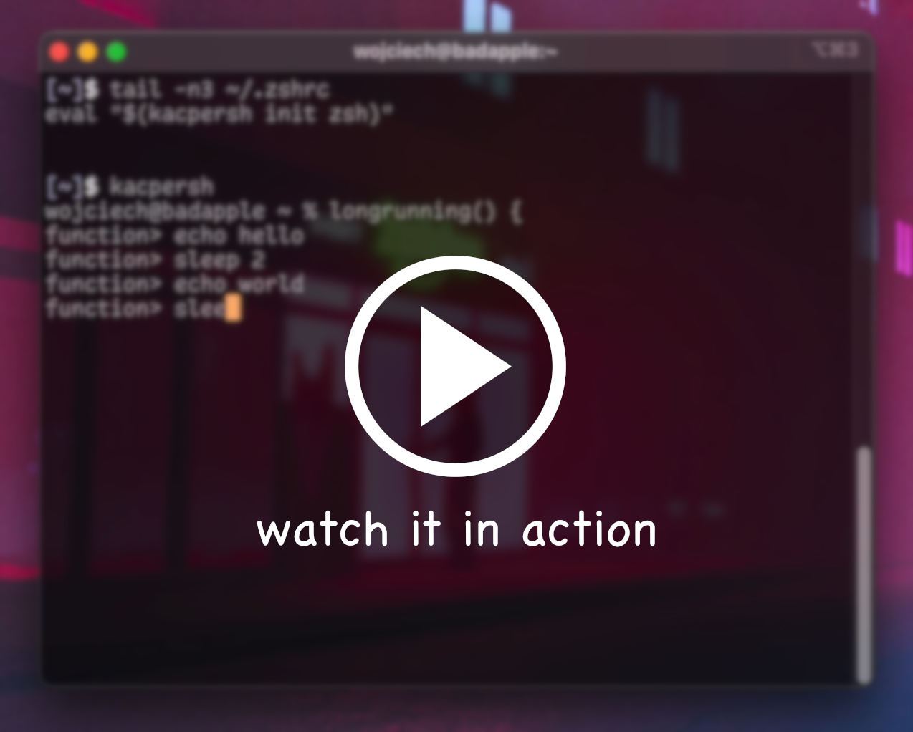

# kacpersh

My friend Kacper told me about an inconvenience that sometimes happened to him - you execute a long running command, then want to do something with the output, but you forgot to redirect it to a file or something, so you have to re-run it all.

The idea is to make the shell/terminal/whatever capture all commands, and make the last command's outputs available to the user easily.

Also, Kacper sounds a bit like "capture". So, it fits.

## Screencast

[](screencast.mp4?raw=1)

## Usage

### Download or build `kacpersh` and put it in your `$PATH`

You can download precompiled `kacpersh` from the [releases page](https://github.com/irth/kacpersh/releases).

Alternatively, install go and compile it yourself:

```sh
go build
sudo mv kacpersh /usr/local/bin
```

### Add it to your `.zshrc`

Currently only ZSH is supported.

```sh
echo 'eval "$(kacpersh init zsh)"' >> ~/.zshrc
```

### Run kacpersh and use the `_` alias to retrieve the stdout of the last command.

```console
$ kacpersh
$ # this is now running under kacpersh
$ echo -n 'test\nhello'
test
hello
$ _
test
hello
$ _ | grep hello
hello
$ _
hello
```

## Proof of concept

https://gist.github.com/irth/ffba9da0a9a4f6df54f02fe06605f19c

[](https://asciinema.org/a/vVu3yRs9bGB8Zrjs9ia301ALw)

## TODO:

### v1

- [x] launch users shell (according to SHELL/profile by default) instead of a hardcoded one
- [x] communicate over a unix socket, path to which is passed through an env variable (so that u can have more than one shell)
- [x] generate config for zsh, so that it can be eval'ed in .zshrc easily
- [x] limit the saved buffer size so that it doesn't fill up your ram (for now I hardcoded it to 32MiB)
- [ ] allow auto-activation through zshrc

### v2

- [ ] in-band signalling - this will allow as to implement buffering for performance, as we don't have to keep perfect synchronisation anymore
- [ ] see if we can support bash and fish

### v3

- [ ] a version of `_` command that doesn't replace the stored output with its own so that you can do something like this:

```console
$ curl example.com/a/slow/api
first line of output
some more output
hello

$ __ | grep some
some more output

$ __ | grep output
first line of output
some more output
```

### v4

- [ ] capture multiple commands instead of just the last one, decreasing the odds of losing data

### sometime along the line...

- [ ] configuration? (e.g. setting last command buffer limit)
